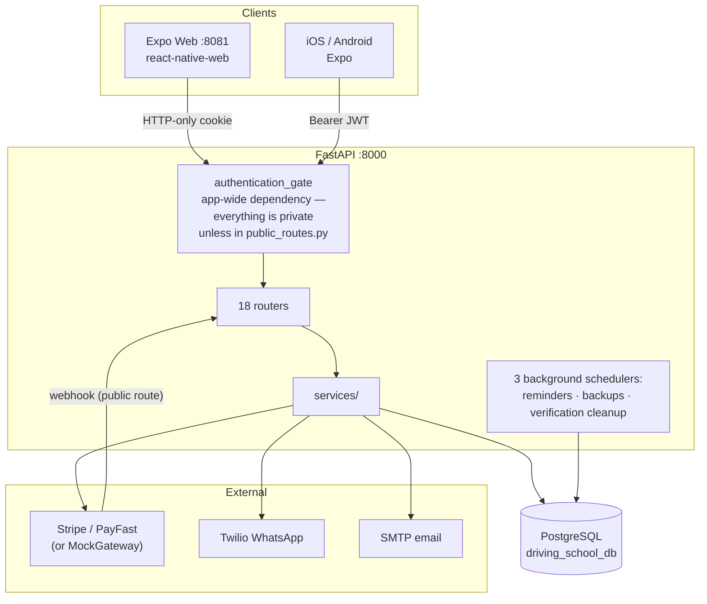
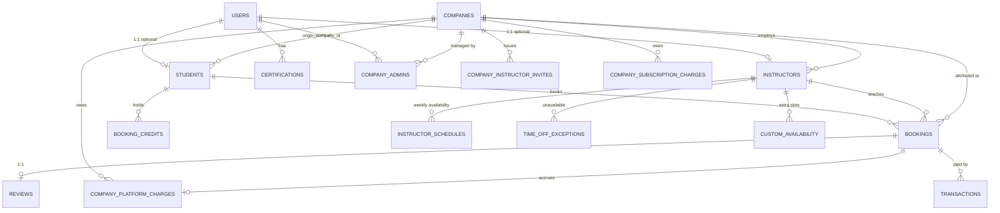
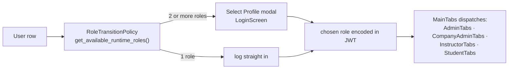
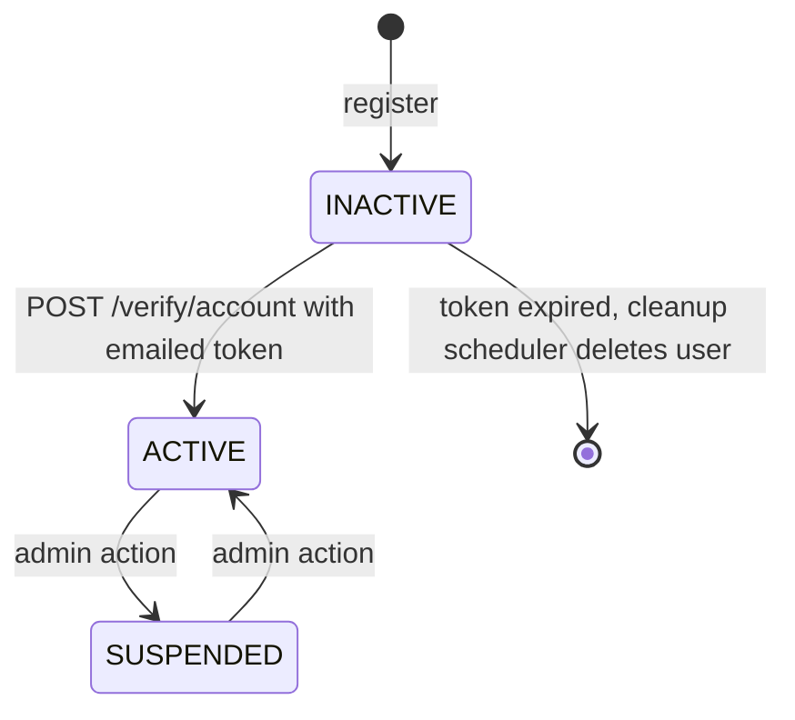
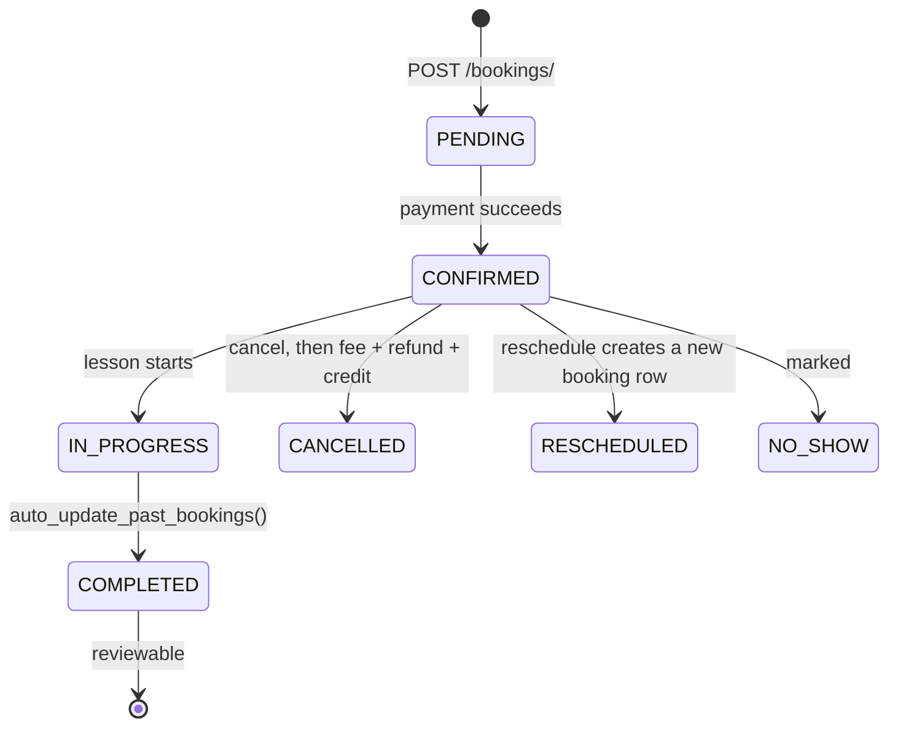

# Drive Alive — Architecture Map

> **Read this first.** This is the living map of the codebase. It exists so that
> a question like *"where does the student price come from?"* is answered by
> looking here, not by re-reading 40 files.
>
> **Last verified against:** `f9d7ae0` · app version 8.1.0 · 2026-08-12
> **Update protocol:** see [§11](#11-update-protocol). If you add a model, a
> route or a screen and do not update this file, it starts lying.

| Companion doc | What it owns |
|---|---|
| `CLAUDE.md` | Commands + subsystem contracts. Short, accurate, always loaded. |
| `AGENTS.md` | The merge gates and the design-system / a11y contract. |
| `README.md` | User-facing install and deployment. Partly stale (see §10). |
| **This file** | The structural map: what exists, how it connects, where the money goes. |

---

## 1. How to use this file

- **Answering a question?** Jump to §7 (backend routes) or §8 (screens) to find
  the file, then read that file. Don't grep blind.
- **Changing money logic?** Read §6 first. Prices are computed in exactly one
  place and duplicated nowhere; keep it that way.
- **Adding a screen?** §8 plus the `responsive-screen` and `rn-a11y` skills.
- **Something behaving strangely?** Check §10 — it is probably a known trap.

---

## 2. System overview



**Auth model.** JWT HS256 carrying a `jti`. On login the `jti` is written to
`users.active_session_token`; every later request checks it matches. A login
elsewhere overwrites it and silently kills the first session — this is
deliberate single-session enforcement, and it is the single most common cause of
confusing "I got logged out" behaviour during testing. `force_login=true`
steals the session on purpose.

**Security posture is default-deny.** `app/middleware/authentication_gate.py` is
registered as an app-level dependency, so a new route is private the moment you
add it. To make one public you must add it to `app/middleware/public_routes.py`.

---

## 3. Data model



### The three identity tables

`User` is the account. `Instructor` and `Student` are **optional profiles** hung
off it. One human can hold several at once — this is why:

- `users.email` is `unique=True` (one account per address)
- **`users.phone` is deliberately NOT unique** (the same person, several roles)
- `id_number` uniqueness is enforced *in application code*
  (`app/services/auth.py:138-149`), across instructors **and** students, not by a
  DB constraint

### Key columns you will actually need

| Table | Column | Why it matters |
|---|---|---|
| `users` | `active_session_token` | single-session enforcement |
| `users` | `failed_login_attempts`, `account_locked_until` | lockout |
| `users` | `commission_percent` | platform default, lives on the *first admin row* |
| `users` | `smtp_password`, `twilio_*` | Fernet-encrypted at rest |
| `instructors` | `verification_status` | the state machine in §5 |
| `instructors` | `hourly_rate` | what the instructor **earns**, not what the student pays |
| `instructors` | `company_markup_type` / `company_markup_value` | the school's cut |
| `students` | `origin_company_id` | who recruited them → decides commission |
| `bookings` | `amount` | what the student **pays** |
| `bookings` | `instructor_base_amount`, `company_markup_amount` | the split |
| `bookings` | `booking_source` | platform vs school-sourced |
| `companies` | `is_platform_host` | exactly one row, partial unique index |
| `companies` | `is_solo` | auto-created one-person company per independent |

**Every instructor belongs to a company.** Independents get an auto-created
"solo company" (`company_service.ensure_solo_company`) so that every booking has
something billable attached. There is no null-company path.

---

## 4. Roles and permissions

Four runtime roles: `student`, `instructor`, `admin`, `company_admin`.



| Guard | File | Scope |
|---|---|---|
| `require_admin` | `app/middleware/` | Platform operator. **Exact `UserRole.ADMIN`** — a `company_admin` is refused by construction (`tests/test_require_admin_boundary.py`). |
| `require_company_admin` | `app/middleware/company.py` | One school only. Company id comes from `CompanyContext`, **never from the request body** — that is the whole point of the guard. |

`RoleTransitionPolicy.assert_runtime_role_ready()` blocks instructor login until
`verification_status == VERIFIED`.

---

## 5. State machines

### Account activation (everyone except admins)



Admins created via `POST /setup/create-initial-admin` or `POST /admin/create`
are **ACTIVE immediately and never email-verified**.

### Instructor credential verification (orthogonal to the above)

```mermaid
stateDiagram-v2
    [*] --> PENDING_ADMIN: registers independently, or on a school invitation
    [*] --> PENDING_COMPANY: registers by joining an existing school
    PENDING_ADMIN --> VERIFIED: admin approves; school gate closed or not needed
    PENDING_ADMIN --> PENDING_COMPANY: admin approves a school member the school has not cleared
    PENDING_COMPANY --> PENDING_ADMIN: school owner approves; admin gate still open
    PENDING_COMPANY --> VERIFIED: school owner approves; admin gate already closed
    PENDING_ADMIN --> REJECTED: admin rejects
    PENDING_COMPANY --> REJECTED: school owner rejects
    VERIFIED --> [*]: can now log in as instructor
```



The public `/companies` list is **not** every company. `get_joinable_schools()`
drops solo one-person companies and the platform host: a solo company is named
after its instructor, so it shows up as a person's name in a "choose your
school" list, and `needs_company_approval` treats solo membership as needing no
approval — so picking one from a public dropdown would attach a stranger to
someone's one-person business with nobody asked. The way into a solo company is
an invitation, which calls `promote_solo_to_school` first.

**`verification_status` names the gate still open, not the step already done.**
Both links go out at registration, so the two gates can be cleared in either
order and the *second* one produces `VERIFIED`. What records that a gate is
closed is not the status but the stamp: `verified_by_admin_id` for the admin
gate, `verified_by_instructor_id` for the school gate.
`company_service.needs_company_approval()` is the single reader of the school
gate — never re-derive it from `company_id` and `is_company_owner`, which reads
solo instructors and already-approved members as still waiting.

Two consequences that are easy to get wrong:

- **Whoever closes the second gate finishes the workflow**, so both closers must
  check the other stamp. `verify_instructor` does that through
  `needs_company_approval`; `verify_company_token` checks `verified_by_admin_id`
  directly. Skipping either check reopens a queue that has already been worked.
- **An invitation is the school's approval.** `auth.register_instructor` stamps
  `verified_by_instructor_id` with the inviting school's owner at acceptance, so
  an invited instructor needs one admin click, not a round trip back to the
  school that invited them.

Notify on the **resulting status**, never on the caller's `is_verified` flag: an
approval that lands in `PENDING_COMPANY` is not a rejection, and the instructor
must not be told otherwise while their school is being asked to approve them.

Two separate 72-hour tokens: `admin_verification_token` and
`company_verification_token`. An instructor therefore has **two independent
gates** — account activation *and* credential verification — and both must pass.

### Booking lifecycle



Cancelling **reverses the platform charge** (`billing_service.void_platform_charge`).
This was a real bug once: cancelled lessons kept being billed. Don't regress it.

---

## 6. Money flow — read before touching pricing

```
student pays   =   instructor_base_amount   +   company_markup_amount
                   |                            |
                   instructors.hourly_rate      company_markup_type/value
                                                (percent or amount)

platform keeps =   commission on the markup (only if booking_source == platform)
               +   subscription per instructor per month
```

| Concern | Single owner | Never duplicate this |
|---|---|---|
| Prices | `app/services/fees.py` | `resolve_markup`, `resolve_student_price`, `resolve_booking_source`, `calculate_platform_charge`, `break_even_markup_ratio` |
| Charge ledger | `app/services/billing_service.py` | `record_platform_charge`, `accrue_subscription`, `void_platform_charge`, `company_statement`, `platform_revenue` |
| Company lifecycle | `app/services/company_service.py` | `create_company`, `ensure_solo_company`, `ensure_platform_host_company` |

**`booking_source` is the commission switch.** A student the school itself
enrolled (`students.origin_company_id` set, via `POST /company/students`) is
school-sourced, so the platform takes no commission. A student who found the
instructor through the platform is platform-sourced, and commission applies.

**Two different "revenue" numbers exist and they are not the same:**

- `GET /admin/revenue/stats` — **gross**, what students paid in total
- `GET /admin/platform-revenue` — **net**, what the platform actually keeps

Reporting one as the other is the easiest way to be wrong here.

---

## 7. Backend routes

18 routers, mounted in `app/main.py`. Auth column: `admin` = `require_admin`,
`co-admin` = `require_company_admin`, `public` = listed in `public_routes.py`,
`auth` = any signed-in user.

| Router | Prefix | Endpoints | Auth |
|---|---|---|---|
| `auth.py` | `/auth` | `register/student`, `register/instructor`, `register/company` (all 3/hr/IP), `login` (5/min/IP), `logout`, `me` (GET/PUT), `inactivity-timeout`, `check-unique`, `change-password`, `forgot-password`, `reset-password` | mixed |
| `setup.py` | `/setup` | `status`, `create-initial-admin` (3/hr, first-run only), `save-services`, `wizard`, `admin-contact` | public |
| `db_setup.py` | `/db-setup` | `status`, `test`, `configure`, `reset`, HTML wizard | mixed |
| `admin.py` | `/admin` | 40+ endpoints — see §7.1 | admin |
| `database.py` | `/admin/database` | `backup`, `reset`, `restore`, `backups/*` | admin |
| `database_interface.py` | `/admin/database-interface` | CRUD grid over users / instructors / students / bookings, plus `reviews`, `schedules`, `bulk-update` | admin |
| `bookings.py` | `/bookings` | `/` (POST/GET), `bulk`, `my-bookings`, `{id}` (GET/PUT), `{id}/cancel`, `{id}/confirm`, `{id}/reschedule`, `{id}/instructor-reschedule`, `reviews`, `credits/available`, `credits/history` | auth |
| `instructors.py` | `/instructors` | list + `{id}` (**public**), `me`, `me/location`, `my-bookings`, `earnings-report`, `availability`, verify / unverify, company roster + approve / reject, invite accept / decline, `me/company-requests`, `me/leave-company` | mixed |
| `availability.py` | `/availability` | `schedule` CRUD + `bulk`, `time-off` CRUD, `custom` CRUD, `overview`, and **public** `instructor/{id}/slots` | mixed |
| `instructor_setup.py` | `/instructors/setup` | pre-auth schedule setup via one-time `setup_token` | token |
| `company.py` | `/company` | `pricing`, `instructors/{id}/markup`, `invites` CRUD, `students` (enrol + list), `students/{id}/resend-verification`, `statement` | co-admin |
| `companies.py` | `/companies` | list (**joinable schools only** — solo and platform-host rows excluded) + `{id}` — **no POST** | public |
| `payments.py` | `/payments` | `initiate`, `webhook` (**public**, signature-verified), `session/{id}`, `mock-complete` | mixed |
| `students.py` | `/students` | `me` (GET/PUT), `{id}`, `by-user/{id}` | auth |
| `certifications.py` | `/certifications` | `me` CRUD, `user/{id}` | auth |
| `verification.py` | `/verify` | `account`, `status`, `resend`, `instructor`, `instructor/admin`, `instructor/company`, `test-email`, `test-whatsapp` | mixed |
| `webhooks.py` | `/webhooks` | `twilio/status` | token |
| `unsubscribe.py` | *(none)* | `GET/POST /unsubscribe` — RFC 8058 one-click, HMAC token | public |

### 7.1 Admin analytics

| Endpoint | Returns |
|---|---|
| `GET /admin/stats` | user / instructor / student / booking counts, total revenue, avg booking value |
| `GET /admin/analytics/timeseries?days=1..365` | daily bookings / completed / cancelled / revenue |
| `GET /admin/analytics/breakdown` | status mix, completion + cancellation rate, role mix, 30-day growth, avg lessons per student |
| `GET /admin/revenue/stats` | **gross** revenue + top instructors |
| `GET /admin/platform-revenue?period=YYYY-MM` | **net** platform take, by school |
| `GET /admin/revenue/by-instructor/{id}` | one instructor |
| `GET /admin/instructors/{id}/earnings-report` | detailed earnings |
| `GET /admin/instructors/earnings-summary` | all instructors, unpaged |
| `GET /admin/instructors?verification_status=&search=&skip=&limit=` | verification list; `search` covers name, email, phone, SA ID, licence, instructor id and user id |
| `GET /admin/bookings?status_filter=&search=&skip=&limit=` | booking list; `search` covers reference, ids, names, SA IDs and lesson date |

---

## 8. Frontend screens

Root stack in `App.tsx` picks `Setup` / `Login` / `Main`. `navigation/MainTabs.tsx`
then dispatches on `userRole`. **Web URLs are nested React Navigation paths**
(`/Main/DashboardTab/AdminDashboard`), not flat slugs.

| Group | Screens |
|---|---|
| **Auth** (12) | Login, RegisterChoice, RegisterStudent, RegisterInstructor (4-step wizard), RegisterCompany, Setup, VerificationPending, VerifyAccount, ForgotPassword, ResetPassword, InstructorInvite, InstructorScheduleSetup |
| **Admin** (13) | AdminDashboard, UserManagement, CreateUser, CreateAdmin, EditAdminProfile, BookingOversight, InstructorVerification, AdminManageInstructorSchedule, RevenueAnalytics, AdvancedAnalytics, InstructorEarningsOverview, AdminSettings, DatabaseInterface *(web-only, lazy)* |
| **Instructor** (6) | InstructorHome, ManageAvailability, EarningsReport, EditInstructorProfile, MyInstructors, PublicInstructorProfile *(public)* |
| **Student** (3) | StudentHome, InstructorList, EditStudentProfile |
| **Company admin** (4) | CompanyAdminHome, CompanyRoster, CompanyPricing, CompanyStatement |
| **Booking / payment** (5) | BookingScreen, PaymentScreen, MockPaymentScreen, PaymentSuccess, PaymentCancel |
| **Other** (3) | Certifications, InstructorVerifyScreen, InstructorCompanyVerifyScreen |

**API access is one object.** `frontend/services/api/index.ts` exports a single
`ApiService` instance (~90 methods). There are no per-domain API modules.

**The four biggest screens** — treat with the `screen-refactor` skill:
`BookingScreen` (1863 L), `LoginScreen` (1445 L), `RegisterInstructorScreen`
(1000 L), `DatabaseInterfaceScreen`.

### 8.1 testID convention

Every `components/ui/` primitive accepts and forwards `testID`. `Input` gets it
by inheritance (`InputProps extends TextInputProps`), so no plumbing is needed.
On web, react-native-web renders it as `data-testid`.

Convention is kebab-case and screen-scoped: `login-email`, `login-submit`,
`reg-student-id-number`, `reg-instr-step2-next`, `booking-slot-3`,
`analytics-timeseries`, `dbi-bulk-actions`.

---

## 9. Cross-cutting contracts

These are owned by `AGENTS.md`; this is the index, not a copy.

| Contract | Source of truth | Gate |
|---|---|---|
| Colour / spacing / type / elevation | `theme/ThemeContext.tsx` | no raw hex, no hand-rolled shadows |
| Viewport | `hooks/useBreakpoint.ts` | **never** a viewport value inside `StyleSheet.create` |
| Content width | `ScreenContainer width=...` | not a per-screen `maxWidth` |
| i18n | `i18n/locales/en.ts` is base; `af` must match | `i18n:check-completeness`, `i18n:detect-hardcoded` |
| Error codes | backend `code` maps to `frontend/i18n/error-code-map.json` | `check_error_code_mapping.py` |
| Accessibility | `components/ui/` reference impl | eslint `react-native-a11y` (warn) |

---

## 10. Gotchas

These have each cost real debugging time.

1. **Single-session JWT.** Logging in as another role kills the previous
   session. Test roles sequentially, or send `force_login=true`.
2. **Registration is rate limited to 3/hour/IP.** Bulk data must be seeded
   directly through SQLAlchemy (`backend/seed_scale_data.py`), never the API.
3. **Web auth is an HTTP-only cookie**, native is `expo-secure-store`. Browser
   automation must persist **cookies**, not localStorage.
4. **`frontend/config.ts`**: in `__DEV__` on web the API base URL is hardcoded to
   `http://localhost:8000` and *ignores* `EXPO_PUBLIC_API_URL`. So `s.bat env net`
   fixes CORS and Expo's host flag, but a phone on the LAN still calls localhost.
   Native dev honours the env var; web dev does not.
5. **Inactivity auto-logout**, default 15 minutes, server-configured. Raise it in
   Admin Settings before a long automated run.
6. **`DatabaseInterfaceScreen` is web-only and `React.lazy`-loaded** — wait for
   the Suspense fallback to clear before asserting on it.
7. **There is no Alembic.** Schema changes go in `_apply_incremental_migrations()`
   in `app/main.py` as idempotent `ADD COLUMN` statements. README says otherwise
   and README is wrong.
8. **NativeWind / Tailwind were removed.** `ROADREADY_REDESIGN_PLAN.md` proposes
   adding them; that document is historical, not a plan of record.
9. **Two Jest suites cannot load** — `jest.config.js` uses the bare `react-native`
   preset, not `jest-expo`, so anything importing `expo-modules-core` dies.
10. **`cypress/e2e/database-interface.cy.ts:19`** asserts a URL containing
    `admin-dashboard`, which no longer matches the generated route. Spec is stale.
11. **`s.bat uninstall` always deletes `venv` + `node_modules`.** It drops the
    database and deletes `.env` **only** with `--all` or an interactive `y`;
    `--yes` explicitly keeps both.
12. **The dev database is PostgreSQL on port 5433**, not the default 5432. The
    `*.db` SQLite files in the repo root are dead legacy artifacts.
13. **Admin list search must match how the endpoint pages.** `/admin/bookings`
    and `/admin/instructors` both cap their result set, so their screens send
    `search` to the server (debounced 350 ms) — a local filter would only ever
    see the loaded page. `/admin/instructors/earnings-summary` is unpaged and
    returns every row, so that screen filters locally with no round trip. Check
    which kind an endpoint is before adding a search box to its screen.
14. **`s.bat start -b` and `start -f` stop *both* servers first.** The flag only
    chooses what gets started again, so `start -f` leaves the backend down. Use a
    bare `s.bat start` to bring the pair back up.
15. **`Login` and `Main` are conditionally mounted; the deep-linked screens are
    not.** `App.tsx` renders the signed-out group (`Login`, `Register*`, …) or
    the signed-in group (`Main`, payment screens) — never both — while
    `VerifyAccount`, `InstructorVerify`, `InstructorCompanyVerify`,
    `InstructorInvite`, `ResetPassword` and `PublicInstructorProfile` are always
    mounted. So `navigation.replace('Login')` from a deep-linked screen is a
    **silent no-op for a signed-in visitor** (and `replace('Main')` is one for a
    signed-out visitor): React Navigation logs *"was not handled by any
    navigator"* and the button looks dead. Route these exits through
    `utils/exitToLogin.ts`, which ends the session when one exists — that is what
    actually swaps the group and puts the login screen on screen.

---

## 11. Update protocol

Keep this file honest. When you change the code, update the matching section
**in the same commit**:

| You changed | Update |
|---|---|
| Added or changed a model or column | §3 (ER diagram + key columns) |
| Added a route | §7 table, and §7.1 if it is analytics |
| Added a screen | §8 table |
| Changed pricing, commission or the charge ledger | §6 — and check nothing duplicated `fees.py` |
| Changed a status enum or transition | §5 state machine |
| Changed auth, guards or public routes | §2 and §4 |
| Hit a trap that cost more than 20 minutes | §10 — write it down so the next run is cheaper |

Then bump the **Last verified against** line at the top to the new commit SHA.

If a section turns out to be wrong, **fix it rather than working around it** —
a map that is 90% right is more dangerous than no map, because it gets trusted.
